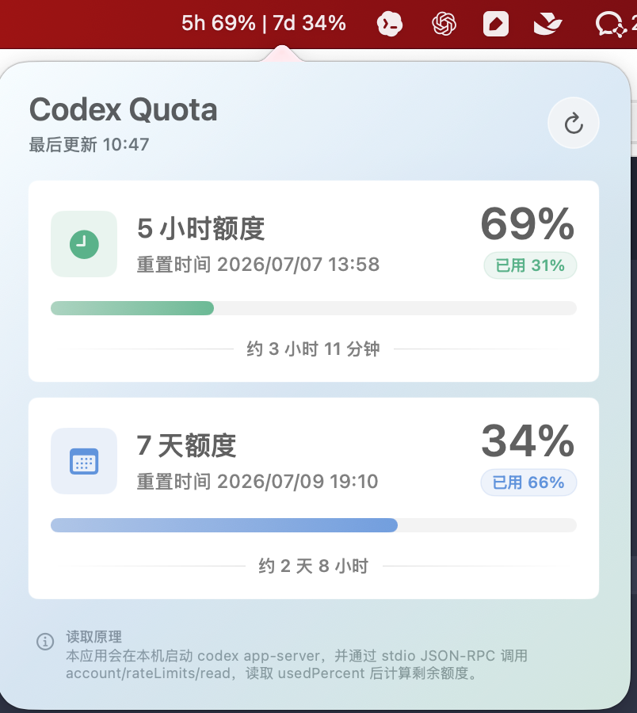
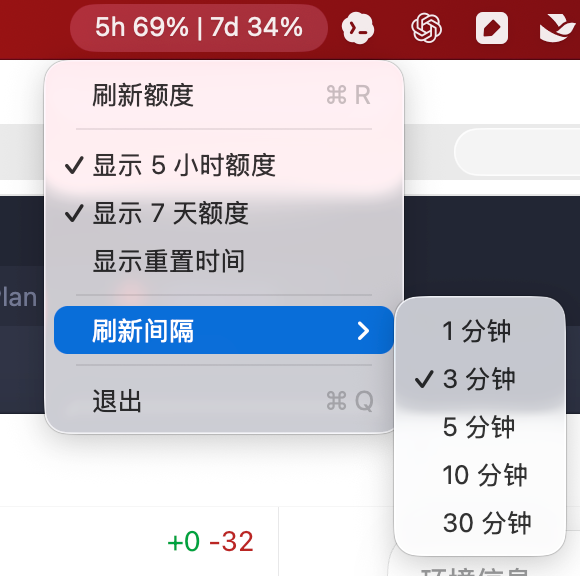

# Codex Quota Mac

[English](README_EN.md)

一个轻量的 macOS 状态栏应用，用来查看 Codex 的 5 小时额度和 7 天额度。应用会隐藏 Dock 图标，只在系统状态栏展示额度信息，点击状态栏文字可以打开详情面板。





## 功能特性

- 在 macOS 状态栏显示 Codex 剩余额度。
- 支持同时展示 5 小时额度和 7 天额度。
- 可显示额度重置时间。
- 支持手动刷新额度。
- 支持设置自动刷新间隔。
- 纯本地读取，不需要额外服务。

## 运行要求

- macOS 15.1 或更高版本。
- Xcode 16 或更高版本。
- 已安装并登录 Codex CLI / Codex App。
- 本机可执行 `codex app-server --listen stdio://`。

应用会按以下顺序查找 `codex`：

1. `CODEX_CLI_PATH` 环境变量。
2. `/Applications/Codex.app/Contents/Resources/codex`
3. `/opt/homebrew/bin/codex`
4. `/usr/local/bin/codex`
5. `~/.npm-global/bin/codex`
6. `~/.local/bin/codex`
7. 当前 `PATH` 中的 `codex`

## 如何运行

1. 克隆项目：

   ```bash
   git clone https://github.com/BaoXiaoShuai/codex-quota-mac.git
   cd codex-quota-mac
   ```

2. 使用 Xcode 打开项目：

   ```bash
   open codex-quota-mac.xcodeproj
   ```

3. 在 Xcode 中选择 `codex-quota-mac` scheme。

4. 点击 Run 按钮运行。

5. 运行后应用不会出现在 Dock 中，请查看 macOS 顶部状态栏里的 `Codex` 文本。

## 使用方式

- 左键点击状态栏文字：打开额度详情面板。
- 右键点击状态栏文字：打开菜单。
- 菜单中可以刷新额度、切换显示项、调整刷新间隔或退出应用。

状态栏示例：

```text
5h 86% 08:09 | 7d 72% 7/14
```

含义：

- `5h`：5 小时额度剩余百分比。
- `7d`：7 天额度剩余百分比。
- 后面的时间：对应额度窗口的重置时间。

## 读取原理

应用会在本机启动 Codex app-server，并通过 stdio JSON-RPC 调用：

```text
account/rateLimits/read
```

然后读取 Codex 返回的 `usedPercent`、`resetsAt` 和 `windowDurationMins`，计算并展示剩余额度。

## 常见问题

### 状态栏显示 `Codex --`

通常表示额度读取失败。请确认：

- Codex CLI / Codex App 已安装。
- 已登录 Codex 账号。
- 终端中可以正常运行 `codex`。
- 如果 `codex` 安装在自定义路径，可以设置 `CODEX_CLI_PATH`。

### 运行后找不到应用窗口

这是预期行为。应用是状态栏工具，会隐藏 Dock 图标和 Cmd+Tab 入口。请在 macOS 顶部状态栏查找 `Codex` 文本。

### 刷新间隔在哪里设置

右键点击状态栏文字，在菜单中的「刷新间隔」里选择 1、3、5、10 或 30 分钟。

## 说明

本项目是一个本地工具，不会上传你的账号信息或额度数据。它只调用本机 Codex app-server 读取额度状态。
